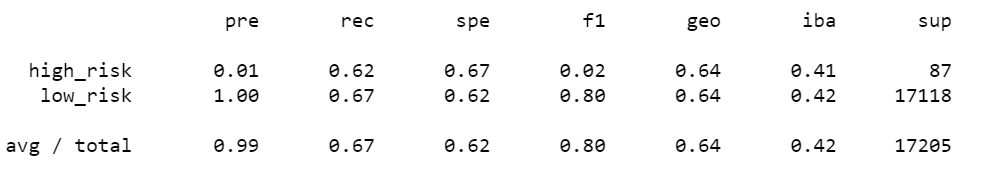
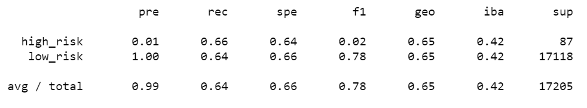
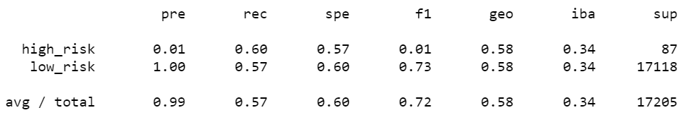
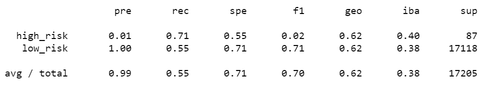
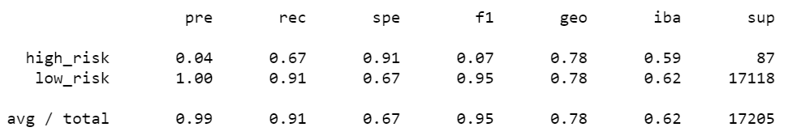
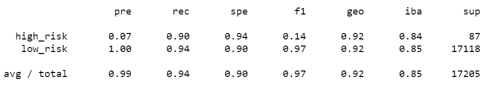

# Credit_Risk_Analysis

## Overview of the analysis
For this module, we are going to analyze credit risk. Credit risk belongs to unbalanced classification problem, since there are good loans number greater than risky loans. And because of this, I am going to use several different techniques to train and evaluate models to better deal with unbalanced classes. I am going to use imbalanced-learn and scikit-learn libraries to build and evaluate models using resampling.

Using the credit card credit dataset from LendingClub, a peer-to-peer lending services company, I will split the data into training and validation sets and:
  - oversample the data using RandomOverSampler and SMOTE algorithms
  - undersample the data using the ClusterCentroids algorithm
  - combinatorial approach of over- and undersampling using the SMOTEENN algorithm

Next, I  will compare two new machine learning models of BalancedRandomForestClassifier and EasyEnsembleClassifier to reduce bias.

Finally, I will analyze the performance(accuracy) of these models.

## Results

### model 1: RandomOverSampler (Logistic Regression)
- model accuracy is 64.42%.

[  54,    33]
[5689, 11429]

### model 2: SMOTE (Logistic Regression)
- model accuracy is 64.83%.

[   57,    30]
[ 6139, 10979]

### model 3: ClusterCentroids (Logistic Regression)
 - model accuracy is 58.51%.

 - model accuracy is 58.51%.

[  52,   35]
[7318, 9800]

### model 4: SMOTEENN (Logistic Regression)
- model accuracy is 62.99%.

[  62,   25]
[7751, 9367]

### model 5: BalancedRandomForestClassifier
- model accuracy is 78.78%.

- model accuracy is 78.78%.

[   58,    29]
[ 1560, 15558]

### model 6: EasyEnsembleClassifier
- model accuracy is 78.78%.

[   78,     9]
[  975, 16143]

## Summary

- By analyzing the above four logistic regression models, I find that the oversample methods(RandomOverSampler and SMOTE) return the highest accuracy of these two are close (64.4% vs 64.8%).
- EasyEnsembleClassifier gives better accuracy(92%).
- Above all, machine learning algorithms give much higher accuracy. In this type of problem,  EasyEnsembleClassifier is recommended.
